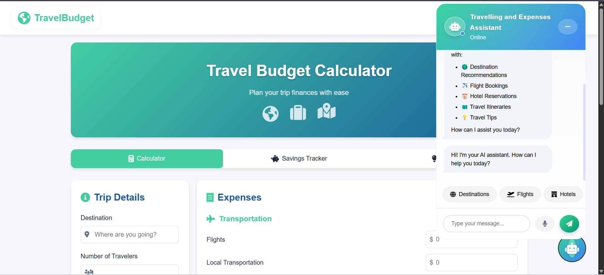

# TravelBudgetCalculator
## Description
FrontendAi is a project designed to streamline frontend development with AI-powered tools. This repository contains both the backend and frontend components of the application.

## Features
- AI-powered frontend development tools.
- Backend Flask API for managing data and AI models.
- Modular and scalable architecture.

## Installation
### Steps
1. Clone the repository:
   ```bash
   git clone https://github.com/echoabhinav/travelbudgetcalculator.git
   ```

2. Install Python dependencies:
   ```bash
    Create a virtual environment
    Open your terminal (or command prompt) and run:
   --- cd backend
   --- python -m venv env
   --- .\env\Scripts\activate
   --- pip install -r requirements.txt
   ```

        --- Running the Backend
         1. Navigate to the backend directory:
               cd backend 
         2. Start the server:
                python app.py
         --- After that you can Go live 



